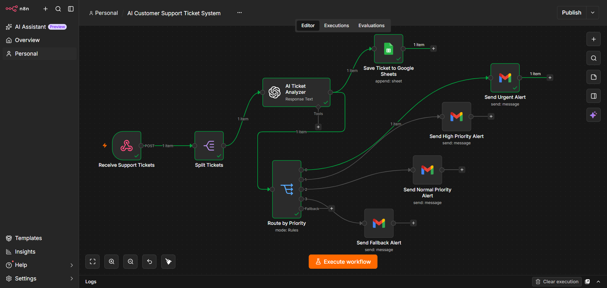

# AI Customer Support Ticket System

## Overview

This workflow is an AI-powered customer support system built with n8n and OpenAI.

It receives customer support requests through a webhook and automatically generates intelligent responses using an AI model.

---

## Features

- Receive support tickets via Webhook
- Process customer messages with OpenAI
- Generate intelligent responses automatically
- Return responses through Respond to Webhook
- Easy integration with websites and applications

---

## Technologies

- n8n
- OpenAI
- Webhooks
- JSON
- REST API

---

## Workflow

1. Receive customer request.
2. Send message to OpenAI.
3. Generate AI response.
4. Return response to the client.

---

## Files

- ai-customer-support-ticket-system.json
- workflow.png

---

## Author

Yassine El Hayani
